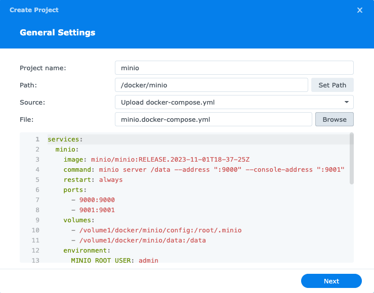

# README

## Container Manager

1. install Container Manager via Synology `Package Center`

    1. open `Package Center`
    2. search for `Container Manager`
    3. click `install`
    

## SSH service

1. enable `SSH`
    1. go to `Control Panel / Terminal & SNMP / Terminal`
    1. check `Enable SSH service`
    2. click `Apply`
    

2. disable `SSH`
    1. go to `Control Panel / Terminal & SNMP / Terminal`
    2. uncheck `Enable SSH service`
    3. click `Apply`
    

## KeyCloak

- references
  - [container image information](https://quay.io/repository/keycloak/keycloak?tab=info)
  - [container guide](https://www.keycloak.org/server/containers)

1. @ synology nas

    ssh to the synology nas

    ``` sh
    mkdir -p /volume1/docker/keycloak/data/database
    ```

2. @ the DSM

    
    
    
    

## MinIO

1. @ synology nas

    ssh to the synology nas

    ``` sh
    mkdir -p /volume1/docker/minio/{config,data}
    ```

2. @ the DSM

    
    
    
    

## Harbor

- references
  - https://github.com/goharbor/harbor/releases

1. ssh to the synology nas

    ``` sh
    # go to docker directory
    cd /volume1/docker

    # download the Harbor installer
    wget https://github.com/goharbor/harbor/releases/download/v2.9.1/harbor-online-installer-v2.9.1.tgz

    # extract the installer
    tar -xvf harbor-online-installer-v2.9.1.tgz

    # setup the required directories
    mkdir -p /volume1/docker/harbor/{data,config,log/harbor,secret,certs,common/config}
    ```

    generate a certificate authority certificate and a server certificate
    ``` sh
    sh generate-certs.sh `REGISTRY`
    ```

    ``` sh
    # fix permissions
    sudo chown -R 10000:10000 /volume1/docker/harbor
    sudo chmod -R 755 /volume1/docker/harbor

    # run the Harbor prepare script
    cd harbor
    sudo ./prepare --with-trivy

    sudo mv docker-compose.yml docker-compose.yml.tmpl
    ```

2. @ the DSM

    
    
    
    
